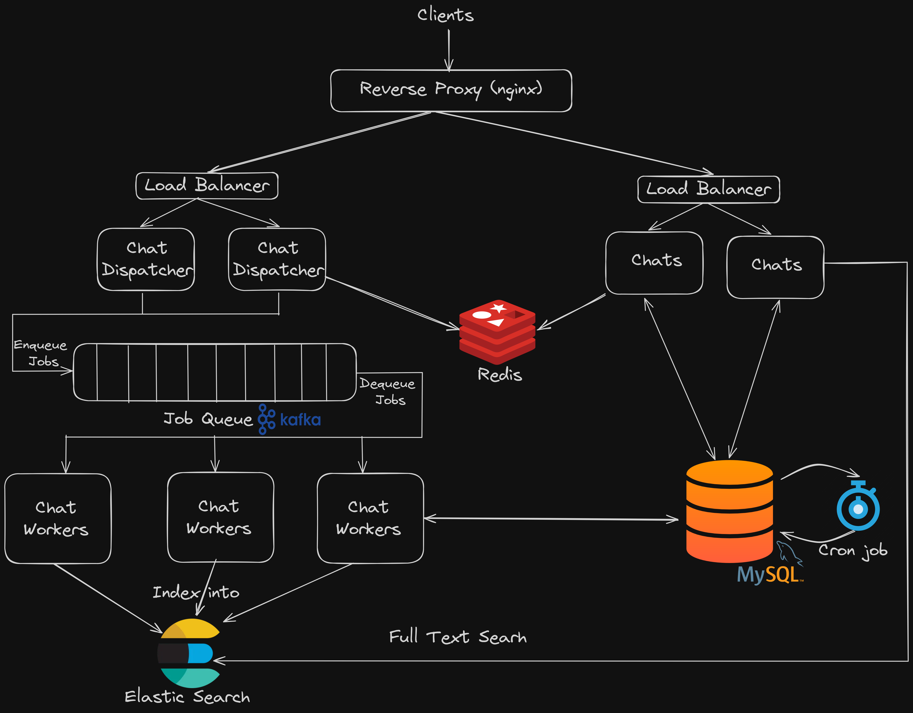

# Instachat

Instachat is a messaging application built using both Ruby and Golang.

## Systm Architecture





There are 3 main components to the system:

### Actors On the Scene

#### 1. `Chats Service` (Rails)

This is the main service that serves the RESTful API for all the endpoints except for the endpoints concerning chats and messages creation.

#### 2. `Chat Dispatchers` (Go)

A Golang web server responsible for handling requests for chats and message creation. It pushes the requests as jobs in a message queue for the workers to handle later.

#### 3. `Chat Workers` (Rails)

These workers can be thought of as background jobs, they continually poll the message queue for jobs, then perform them.

### System Design in Depth

- In any real backend application, we always strive for scalability, and efficiency.
I believe the main bottleneck in this chat applicaiton is the gigantic number of requests especially for creating messages. Let's get real, the number of messages can easily reaches millions and even billions (if it gets popular enough). 
That's why I tried to design the system with scalabilty in mind: "What happens if our customer base keeps getting bigger?". That is the main question!

- With millions of requests per second, it would be almost impossible for the servers using the traditional request-response architcture to handle the flood of requests even with horizontal scalabilty (multiple servers, multiple processes, ...).
The idea is that the servers need to process the requests and serve resources, the time taken to process a request will likely increase as the size of the database increases.
This introduces latency that is exepcted to go higher in the future (even though we are not doing any actual processing now).
This latency will be the main bottleneck in the applicaitons and customers are likely to be discouraged.

- Here comes the main advantage of using message queues. Instead of processing the request on the fly, the servers just push the request as a job, this takes almost O(1) time, and it is likely to stay so.
This is the main purpose of `Chat Dispatchers`, they receive the requests, push them in the queue, and almost immediately gives them a response.
That's why this service is implemented in go because it's much faster than Ruby.

- Then comes the role of `Chat Workers`, they do all the heavy work in the backgrond! The workers polls the queue periodically for encoming jobs and perform them.
They also index the messages in `Elastic Search` after they are created to enable full text search.

- The workers are implemented using `Karafka` server which is a high level client library for dealing with kafka. Karafka is great becuase it abstracts away threading, pools, polling, retry mechanisms. Making it extremely easy to scale the number of workers.

- Another free advantage that comes with using message queues is that the services are decoupled from each other, which makes it easier to horizontally scale each of them freely.

### Why Kafka?

- My first choice of the message queue was `Sidekiq`, it's natively supported in rails, fast because it's backed up by redis and dealing with it in go is relatively easy.

- However it has serious drawback, as the size of the data/customers increases, it requires large memory to deal with that increase which can lead to serious ramificaions. For example AppSignal in this [Article](https://blog.appsignal.com/2019/04/23/kafka-sidekiq-ruby.html) explains how the huge increase in memory demand not only prevnted them from receiving more requests but it prevented the dequeue of jobs in the queue leading to some kind of deadlock.
They also share their experience in migrating from Sidekiq to Kafka incrementally.

- On the other hand, `Kafka` offers high throughput, fault tolerance, scalability, durability, and low latency which makes it the best candidate in production environment.

- One drawback of `Kafka` is handling retry mechanisms, thus a possibility here is to integrate both `Kafka` with `Sidekiq` to get the best of both worlds.

### Handling Race Conditions and Concurrency

- In a distributed system, concurrency gets a little bit trickier, we need to synchronize across mulitple instances of the servers possibly on different nodes in the cluster for this we need some kind of distributed locks.

- The approach I took is to use `Redis` as a coordinator by leveraging its atomic operations to distribute the chat numbers and message numbers.
Atomicity ensures handling race conditions gracefully, but on the other hand it introduces contenion and may become the bottleneck in performance, because operations on the same resource are serialized.

- However, I believe the load is somewhat distributed because not all request are issued on the same key (different message requests use different chat keys).

- Handling applicaiton tokens is slightly different. Tokens are not autoincrementing integers and thus we only need to make sure they are unique. 
The main idea is here is that algorithms like secure hashing and UUID, guarantees (with a high probability) that the generated tokens are unique, and since the number of applications is not expected to be huge (which is different from the number of messages), we can ignore this small probability.
Or if we need to be very robust, we may use a similar approach using `Redis`.

- It comes free with this approach, the ability to make quick validations on the requests using the information stored in `Redis` like checking if the app or chat exists.

### Handling Count Columns

The columns `chat_count` and `messages_count` can be thought of as a mini `Materialized Views` since they are really the result of a count query "materialized" as columns in the tables.

A tradeoff naturally comes with the scheme to update materialized views
- Update with every request
    Althoug this achieves maximum consistency, it hurts performance becuase they must be updated with each request leading to a decline in performance.
- Periodic update
    This approach doesn't gaurantee the materialized views are consistent with the data but they will be "eventually consistent".
    This is a typical tradeoff: sacrifice a little bit of consistncy for reducing latency.


The Approach I chose is the periodic update
     
- A cron job runs periodically every 1 hour to update these columns using background jobs.
But there's a very important point here: a full update is not feasible in most cases. Yes, we are dealing with only two columns but imagine if at some point we need to aggregate huge amount of data in very complex queries, this may take very long time, and worse the time will increase linearly with the amount of data.

- Hence, we need to implement incremental updates which means that we only account for the difference between the last update and the new update.
The way this is implemented is by keeping track of the timestamp of the last update, so we only need to count the chats/messages between this time till the current time at each update. This is done using teh created_at column with appropiate indices to make sure we can perform the query very efficently.

## Database Design

The tables and their associations are simple enough. Only three tables
- `Applications`
- `Chats`
- `Messags`

### Choosing the Primary Key

For `Applications`, it might be tempting to choose `app_token` as the primary key but this in fact is a bad idea. 
The primary key is used to build the primary index which physically order the records on the disk, so using a non-auto increment key will result in many page splits during insertions, and possibly random IOs during search.

Moreover, in MySQL (InnoDB), the primary key is included at each entry of any secondary index (the indices point to the primary key), this means that choosing a string or UUID as the primary key will make the indices large and will cost IOs.

For `Chats` and `Messags`, the chat_num and message_num columns are not enough to uniquely identify each row, fo example, we need the app_token or app_id along with chat_num to uniquely identify a chat.
So a possibility here is to use composite primary keys, but again for the same reasons as above, this is a bad idea.

Hence, for the 3 tables, we use a simple autoincrement id column for the primary key.

### Implementing Relationships

The tables has the following relations:
An application has many chats, while a chat has many messages

There are two choices here
- Implementing the relationships using a foreign key on the id of `Applications` and `Chats`
    Although this has many advantages like there's no redundancy and more robust validations, it makes the queries inefficient, for example, in order to retrieve the messages of a given chat in a given application, we need to join the three tables together. 

- Implementing them using `app_token` and `chat_num`
    Since almost all the queries use `app_token` and `chat_num` for identification, it will be better to include them in the tables instead of the ids, this introduces some redundancy but I think it's a better choice given the gain in performance.

    However, we still need to enforce referential integrity. One problem I faced is that rails doesn't support composite foreign keys.

### Choosing Indices

Indices are not free, they come at a cost and thus choosing the right set of indices is essential. 

- `Applications`
  - A single index on `app_token`
        This is not very important for the current access patterns, it's included mainly as a unique index to ensure uniqueness.
    Also, I believe it might be helpful in the future.
- `Chats`
    - (`app_token`, `chat_num`)
        This is exremely important for the queries of getting the chats of a given applicaiton (a prefic of a composite index can be used), and also to update a given chat.
        It's also important in pagination (cursor based not offset).
    - (`app_token`, `created_at`)
        This is used in the query to update the `chats_count` column.
- `Messags`
    - (`app_token`, `chat_num`, `message_num`)
        Same usage as above.
    - (`app_token`, `chat_num`, `created_at`)
        This is used in the query to update the `messages_count` column.

## Usage

To get started with Instachat, follow these steps:

1. Run docker compose to get the whole stack up and running:

   ```bash
   docker compose up
   ```

2. Database Migrations:

   - Wait for MySQL to initialize 

   - Attach to chats container:

     ```bash
     docker exec -it chats bash
     ```

   - Run the migrations:

     ```bash
     rails db:migrate
     ```

   - Initialize the database with seeds (optional)
  
     ```bash
     rails db:seed
     ```   

     Please note that while I tried to ensure the consistency of the seeds they may not be consistent with other services specially because the database state is not consistent with redis at this stage.

3. Schedule the cron jobs
   - Schedule
  
     ```bash
     whenever --update-crontab --set environment=$RAILS_ENV
     ```    

   - **Note**
    For some reason that I wasn't able to figure out despite debugging for a full day, there's a problem with crontab in the docker image which prevents the scheduled cron jobs using whenever gem from running. 
    Thus in order to confirm the cron job and the update logic, please run the following command in the chats container:
  
     ```bash
     bundle exec rails runner UpdateCountsJob.perform_now
     ```     

## License

This project is licensed under the MIT License - see the [LICENSE](LICENSE) file for details.
